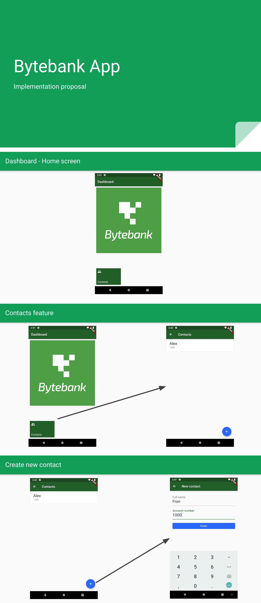

# PERSISTENCIA COM FLUTTER   

##### Tecnologias Utilizadas:

    
    

##### Descrição:

###### Projeto está sendo desenvolvido durante segundo módulo da formação para desenvolvedor Flutter pela plataforma Alura Cursos.

<h5>Proposta do Módulo:</h5>

 
                                        

